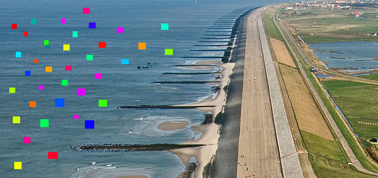

# pixeldike

[](https://crates.io/crate/pixeldike)
[](https://docs.rs/pixeldike)

> A fast and reusable pixelflut implementation

Pixelflut is a competitive programing game that provides a 2D pixel canvas upon which many people can set single color values over the network.



The implementation contained in this repository is done in Rust and includes a reusable library as well as a standalone binary.
The library

## Features

The following features are implemented:

- Generic protocol serialization and parsing
- TCP Transport
- UDP Transport
- WebSocket Transport
- Live-Streaming of the servers canvas via RTMP/RTSP
- Live-Display of the servers canvas via a window or linux framebuffer device
- Drawing of images (and colored rectangles) on a remote servers canvas

## Installation

### Install via cargo from source

This installation methods assumes you already have a working rust toolchain and a working
*cargo* command.
If you do you can run the following:

```bash
cargo install --git=https://github.com/ftsell/pixeldike.git --all-features --bin=pixelflut
```

## Usage examples
- Retrieve command-line help

  ```bash
  pixeldike -h
  pixeldike server -h
  ```

- Start a pixelflut tcp server on port 1234 with default size and persisted in the file *~/pixmap.pixmap*

  ```bash
  pixeldike server --file ~/pixmap.pixmap --tcp 1234
  ```

- Start a pixelflut udp server on port 1234 with custom size and persisted in the file *~/pixmap.pixmap*

  ```bash
  pixeldike server --file ~/pixmap.pixmap --udp 1234 --width 10 --height 20
  ```
